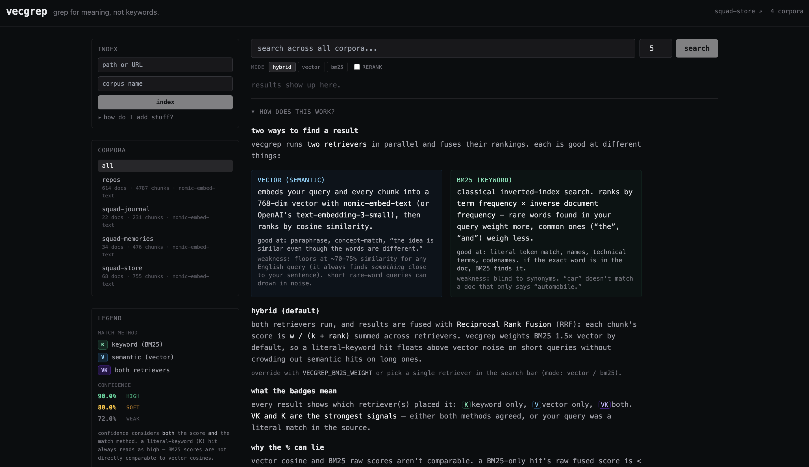

# vecgrep

> grep for meaning, not keywords

**v1.2.0 + current main** · stable CLI, HTTP API, and MCP surfaces · see [CHANGELOG.md](CHANGELOG.md) for release history

`vecgrep` is a local-first semantic search engine for any corpus you throw at it. Drop in documents — text, markdown, PDFs, URLs — and search by concept instead of exact words. Runs on your machine, no cloud roundtrip required.



*The web UI: index a corpus from the sidebar, pick a mode (hybrid / vector / bm25), search. Each result shows confidence (high / soft / weak), which retriever found it (V semantic, K keyword, VK both), and the matched chunk in context. Tucked into the bottom of the page is a primer explaining how vecgrep finds things — vector vs BM25 vs hybrid, what the % can and can't tell you.*

```
$ vecgrep search "what did we decide about rate hikes" --corpus notes
[1]  92.4%  notes  papers/2026-q1-review.md
     ... the committee discussed the path forward and
     the committee opted to hold rates steady through Q2
     citing softening labor data ...

[2]  88.1%  notes  notes/meeting-mar-12.md
     ... after some back and forth
     the rate path discussion landed on no change
     for the rest of the year ...
```

## Why

Keyword `grep` is brittle. You search for `rate hikes`, you miss the doc that says `monetary tightening`. Embeddings fix that — semantically equivalent text scores high regardless of wording.

`vecgrep` wraps that into a tool that feels like a CLI utility, not a research notebook. No cloud account, no Docker, no Postgres extension, no ceremony. Index a folder, run a query, get ranked chunks back with surrounding context.

The closest equivalents — `txtai`, `chroma`, `LlamaIndex` — are libraries you import. `vecgrep` is a binary you run.

## Contents

- [Status](#status)
- [Install](#install)
- [Quickstart](#quickstart)
- [What it indexes](#what-it-indexes)
- [How it works](#how-it-works)
- [Storage layout](#storage-layout)
- [Configuration](#configuration)
- [Backup and recovery](#backup-and-recovery)
- [Memory retrieval](#memory-retrieval)
- [Web UI](#web-ui)
- [MCP server](#mcp-server)
- [Writing through MCP](#writing-through-mcp)
- [Roadmap](#roadmap)
- [Why not just use X?](#why-not-just-use-x)
- [Contributing](#contributing)
- [Tests](#tests)
- [License](#license)

## Status

Stable (`v1.2.0`; unreleased work on `main` is documented here too). What's shipped:

- **Retrieval** — hybrid BM25 + vector search, MMR/dedup, hard metadata and time filters, optional recency decay, precise line anchors, timeline/incident reconstruction, query-by-example, temporal comparison, and corpus summaries.
- **Agent surface** — 19 MCP tools over stdio or streamable HTTP: search, location-first browsing, source/chunk expansion, insight tools, corpus discovery, and guarded write/edit/proposal workflows.
- **Serving and auth** — optional REST bearer auth, optional OAuth 2.1 for public remote MCP clients, mixed embedding models across corpora, and Qdrant server mode for concurrent processes.
- **Ops** — incremental and resilient file watching, embedding and bounded BM25 caches, migration, export/import, verified whole-instance backup/restore, `status`, and registry/store reconciliation with `doctor`.
- **UI** — search and timeline views, filters, corpus health, related chunks, expandable context, calibrated relevance tiers, and V/K/VK match badges.
- **Adapters** — plaintext, Markdown, PDF, URLs, Discord JSONL, Claude exports, and ChatGPT exports.

The public CLI and HTTP API have been stable since v1.0. Breaking changes are
reserved for a future major release.

## Install

The `vecgrep` project on PyPI is unrelated. Install this project directly from
GitHub with [uv](https://docs.astral.sh/uv/):

```bash
uv tool install "vecgrep[mcp] @ git+https://github.com/jeffbai996/vecgrep"
```

For an isolated one-shot invocation:

```bash
uvx --from "vecgrep[mcp] @ git+https://github.com/jeffbai996/vecgrep" vecgrep --help
```

Optional extras are `openai`, `rerank`, `watch`, `mcp`, and `dev`. Combine
them in the bracketed list when installing from GitHub.

You also need [Ollama](https://ollama.com) running locally for the default embedding backend:

```bash
ollama pull bge-m3
ollama serve
```

If you'd rather use OpenAI, install with `[openai]`, set `OPENAI_API_KEY`, and `vecgrep` will fall back to `text-embedding-3-small` automatically when Ollama isn't reachable.

## Quickstart

```bash
# Index a folder (mixed file types are fine; incremental — unchanged files skipped)
vecgrep index ./my-docs --corpus papers

# Re-embed everything regardless of content hash
vecgrep index ./my-docs --corpus papers --force

# Index a URL — vecgrep fetches and strips boilerplate
vecgrep index https://example.com/article --corpus web

# Watch a folder and re-index on change
vecgrep watch ./my-docs --corpus papers

# Hybrid search (default — BM25 + vector fused via RRF), top 10
vecgrep search "missile guidance systems" --corpus papers --top 10

# Pure-vector or pure-BM25 if you want to A/B
vecgrep search "rate hikes" --mode vector
vecgrep search "FOMC" --mode bm25

# Watch mode — re-run the same query at a fixed interval, print a diff
# of source IDs. Pair with `vecgrep watch` while ingesting to confirm
# new chunks are showing up where you expect.
vecgrep search "rate hikes" --watch --interval 5

# Cross-encoder reranking on the candidate pool — slower, more accurate
vecgrep search "what did we decide about rates" --rerank

# Filter results — repeatable, all ANDed
vecgrep search "rate hikes" --filter "source:*2026*.md" --filter "corpus:papers"

# Show the score decomposition for each hit (cosine, BM25, RRF, rerank)
vecgrep search "rate hikes" --explain

# Reconstruct a chronological event sequence instead of ranked snippets
vecgrep timeline "what happened during the deploy" --corpus chatlogs \
  --filter after:7d

# Query by example, compare periods, and inspect corpus health
vecgrep related <chunk-id> --corpus chatlogs
vecgrep compare "deployment failures" --corpus chatlogs \
  --a-after 60d --a-before 30d --b-after 30d
vecgrep stats chatlogs
vecgrep summarize chatlogs --after 7d

# Inspect / clear the embedding cache
vecgrep cache stats
vecgrep cache clear --identity ollama:bge-m3

# Re-embed a corpus to a different backend / model
vecgrep corpora migrate papers --to-backend openai --to-model text-embedding-3-small

# Recency decay: down-rank stale chunks. Half-life in days; a hit one half-life
# old ranks as if half as relevant. Good for chat logs / journals; leave off for
# durable reference. No re-index needed — applied at search time from each
# chunk's parsed date.
vecgrep corpora decay chatlogs --half-life 14
vecgrep corpora decay chatlogs --off

# Search across every corpus you have
vecgrep search "rate hikes"

# Don't persist — index, query, throw away
vecgrep index ./scratch --corpus tmp --ephemeral

# Move a corpus between machines
vecgrep corpora export papers --out papers.tar.gz
vecgrep corpora import papers.tar.gz --rename papers-from-laptop

# Manage corpora
vecgrep corpora list
vecgrep corpora delete papers

# One-shot diagnostic: daemon, auth, per-corpus chunk counts, last-update age
vecgrep status
vecgrep status --json    # for scripting / monitoring

# Reconcile the corpus registry with the active vector store
vecgrep doctor
vecgrep doctor --json

# Launch the web UI on http://127.0.0.1:8765
vecgrep serve
```

## What it indexes

| Adapter | Inputs |
|---|---|
| `plaintext` | `.txt`, `.log`, `.csv`, `.tsv`, `.rst`, `.org`, `.tex`, `.srt`, extensionless |
| `markdown` | `.md`, `.markdown`, `.mdx` |
| `pdf` | `.pdf` (text layer only — scanned PDFs need OCR first) |
| `url` | `http://`, `https://` — strips `<script>`, `<style>`, etc., keeps prose |
| `discord_jsonl` | `.jsonl` files where each line is a Discord message (DiscordChatExporter format or any one-message-per-line JSONL with `author` + `content`) |
| `claude_export` | Anthropic data export `conversations.json` — one Document per conversation |
| `chatgpt_export` | OpenAI data export `conversations.json` — one Document per conversation, follows main thread |

Pointing `vecgrep index` at a directory walks it recursively and dispatches each file to the matching adapter. Unrecognized files are skipped silently — no errors.

## How it works

```
                          ┌──▶ vector (qdrant) ──┐
docs ──▶ adapters ──▶ chunkers ──┤                      ├──▶ RRF ──▶ [decay] ──▶ dedup ──▶ [rerank] ──▶ top-k
                          └──▶ bm25 (inverted) ──┘
```

- **Adapters** convert source formats to text. They run once per source; chunkers handle slicing.
- **Chunkers** slice text into overlapping windows. `SentenceWindowChunker` is the default — 3 sentences with 1-sentence overlap. `FixedTokenChunker` (tiktoken-backed) is the alternate for code, logs, anything where sentence boundaries are noisy.
- **Embed backends** are pluggable. Each corpus pins the model it was built with; corpora on different models can be served at once, each querying with its own.
  - Default: Ollama `bge-m3` (1024-dim) — strong on paraphrase-heavy and multilingual queries.
  - Alternates: any other Ollama model via `VECGREP_EMBED_MODEL` (e.g. `nomic-embed-text`, 768-dim, lighter/faster; `mxbai-embed-large`, 1024-dim).
  - Fallback: OpenAI `text-embedding-3-small` (1536-dim) takes over when Ollama is unreachable and `OPENAI_API_KEY` is set.
- **Qdrant** runs in embedded mode (no server, no Docker) at `~/.vecgrep/qdrant/`. Each named corpus is its own collection.
- **BM25** index runs alongside Qdrant, persisted as a pickle per corpus. Tokenizer splits identifiers (`sharpe_ratio` → `sharpe`, `ratio`) so code search isn't blind to underscore- or camelCase-style naming.
- **Concurrent mutation integrity.** Search takes a shared corpus lease; index,
  delete, confirmed writes, and direct edits take an exclusive lease shared by
  API, MCP, CLI, and watcher processes. A durable per-corpus intent journal
  makes Qdrant, BM25, and `corpora.json` one recoverable logical commit: startup
  rolls back an interrupted Qdrant batch or rolls completed vector work forward
  into the derived stores.
- **Hybrid retrieval** is the default. Each retriever returns its top 50 candidates; their ranks are fused via Reciprocal Rank Fusion (`score = Σ w / (60+rank)`). BM25's weight is `1.5` by default — high enough to float exact-keyword hits over the vector noise floor on short queries, low enough to leave long conceptual queries vector-dominated (override with `VECGREP_BM25_WEIGHT`). Pure-vector or pure-BM25 are available with `--mode vector` / `--mode bm25`.
- **Recency decay** (optional, per corpus). Set a half-life in days with `vecgrep corpora decay <name> --half-life N` and a hit's fused score is multiplied by `0.5 ** (age_days / half_life)` — a chunk one half-life old ranks as if half as relevant. Applied *before* the top-k cut, so a fresh chunk can rescue itself above a stale one, and lexical closeness alone can't float a stale chunk to the top. Off by default; undated chunks are never penalized. The date comes from a `doc_timestamp` parsed at index time (frontmatter `date:`/`Saved:` lines, a `YYYY-MM-DD` filename, then file mtime). Tune fast for chat/journal corpora, off for durable reference.
- **Dedup.** The sentence-window chunker emits overlapping windows, so one passage can surface as several near-identical hits. vecgrep collapses same-source hits whose character ranges overlap before truncating to top-k, keeping the strongest, so the result list isn't padded with the same text at three ranks.
- **Confidence display.** The displayed `%` is a calibrated relevance estimate, not a raw score; ranking always uses the underlying fused score.
  - With reranking on: comes straight from the cross-encoder (the cleanest `P(relevant)` proxy).
  - Otherwise: a sigmoid over cosine, **calibrated per embedding model** — different models put their noise floor and signal range in different places, so the same `%` means the same thing across corpora.
  - BM25-only hits (which have no cosine) are rescaled rank-relative, so a real keyword match doesn't read as the `~1.6%` raw-RRF noise floor.
  - The web UI surfaces V/K/VK badges and tier colors plus a "how search works" panel.
- **Cross-encoder reranker** (`--rerank`, off by default) rescores the candidate pool with `BAAI/bge-reranker-base`. Lazy-loaded — the heavy `torch` import only happens when you ask for it. It's a real quality win on hard, paraphrase-heavy queries where plain hybrid whiffs, but it adds meaningful latency (order ~100ms+ for a small candidate pool) and on easy literal queries it can be a wash or worse — so it's opt-in, not the default. Reach for it when a hybrid search returns near-misses for something you know is in the corpus.

Each corpus pins the embedding backend, model, and dimension at index time and refuses to mix models *within* a single corpus — but the engine resolves each corpus's query embedding from its own pinned model, so multiple corpora on different models coexist fine. To change the model of an existing corpus, `vecgrep corpora migrate` it (or recreate it).

## Storage layout

```
~/.vecgrep/
├── qdrant/         # vector store, one collection per corpus
├── bm25/           # BM25 inverted index, one pickle per corpus
├── locks/          # cross-process corpus and registry admission
├── mutations/      # pending crash-recovery intents (normally empty)
├── corpora.json    # named-corpus metadata
└── config.json     # optional, env vars override
```

`--ephemeral` mode (CLI flag or UI toggle) keeps everything in memory and skips both files and the vector store on disk. Useful for a one-shot grep over a directory you don't want polluting your indexed corpora.

## Configuration

`vecgrep` reads from `~/.vecgrep/config.json` and environment variables, in that order. Env vars win.

| Variable | Default | Notes |
|---|---|---|
| `VECGREP_HOME` | `~/.vecgrep` | Storage root |
| `VECGREP_OLLAMA_URL` | `http://localhost:11434` | Ollama endpoint |
| `VECGREP_EMBED_MODEL` | `bge-m3` | Ollama model |
| `VECGREP_OPENAI_EMBED_MODEL` | `text-embedding-3-small` | OpenAI model |
| `OPENAI_API_KEY` | unset | If set, used as fallback when Ollama is down |
| `VECGREP_API_HOST` | `127.0.0.1` | API bind host |
| `VECGREP_API_PORT` | `8765` | API port |
| `VECGREP_API_TOKEN` | unset | If set, `/api/*` requires `Authorization: Bearer <token>` (health stays public). A non-loopback bind requires at least 32 characters. |
| `VECGREP_ADMIN_TOKEN` | unset | Separate bearer token for `/api/admin/*`. Without it, admin access requires both a loopback peer and loopback Host header. |
| `VECGREP_QDRANT_URL` | unset | Use Qdrant server mode, e.g. `http://localhost:6333`. Required when `serve`, `watch`, and CLI processes need the same live store concurrently. |
| `VECGREP_TOP_K` | `5` | Default `--top` value |
| `VECGREP_ALIASES_FILE` | `$VECGREP_HOME/aliases.json` | Entity alias map (personal data — keep it out of any repo). See `docs/aliases.example.json`. Missing = no expansion. |
| `VECGREP_OAUTH_ENABLED` | unset | `1` enables OAuth 2.1 on `/mcp` (embedded auth server: /authorize, /token, /.well-known). |
| `VECGREP_OAUTH_ISSUER_URL` | unset | Public base URL the MCP endpoint is reachable at. Required when OAuth is on. |
| `VECGREP_OAUTH_APPROVAL_TOKEN` | unset | Strong owner approval code entered in the browser before an OAuth client may receive a code. Required when OAuth is on. |
| `VECGREP_THREAD_POOL_SIZE` | `8` | AnyIO worker-thread cap for the HTTP service. |
| `VECGREP_BM25_WEIGHT` | `1.5` | Weight on BM25 contribution to RRF fusion. >1 boosts literal-keyword matches over semantic noise on short queries. Set to `1.0` for pure RRF, higher for keyword-leaning ranking. |
| `VECGREP_BM25_COVERAGE_MODE` | `penalty` | How BM25 treats docs that match only some query tokens. `penalty` keeps them but demotes the score by `(matched/total)²`; `filter` drops anything below a coverage threshold (higher precision, but can zero out the BM25 half of a multi-token query). |
| `VECGREP_EMBED_CACHE_MAX_ROWS` | `50000` | Row cap on the sqlite embedding cache (~1 GB at a 1024-dim model). Oldest entries are evicted first once over the cap. Set `<= 0` to disable the cap. |

Non-secret settings can also live in `~/.vecgrep/config.json`; environment
variables override the file. `vecgrep config` shows the effective value and
provenance for each setting, while `vecgrep init --yes` creates an initial
config file.

Embedded Qdrant is deliberately the zero-ceremony default, but it permits one
process at a time. A long-running deployment with `serve` plus `watch` must pin
the same `qdrant_url` in `config.json` for *every* process; setting it only in a
service environment can split the daemon and an interactive CLI across two
different stores. `vecgrep doctor` detects registry/store drift, but naturally
it can only inspect the backend selected by its own effective config.

## Backup and recovery

Whole-instance backups contain per-corpus Qdrant snapshots, the corpus
registry, non-secret configuration, aliases, and write-through documents.
Embedding caches and BM25 pickles are excluded; BM25 is rebuilt from trusted
Qdrant payloads after restore.

```bash
vecgrep backup create
vecgrep backup list
vecgrep backup verify ~/.vecgrep/backups/vecgrep-<id>.vgbak
vecgrep backup restore ~/.vecgrep/backups/vecgrep-<id>.vgbak --confirm <id>
```

Restore verifies every checksum, requires the exact backup ID, creates a
pre-restore safety backup, and rolls back automatically on failure. An optional
daily or weekly scheduler is disabled by default. Retention applies only to
scheduled backups; manual and safety backups are never pruned.

## Memory retrieval

vecgrep's highest-value real-world use turned out to be searching messy,
multilingual chat transcripts as a personal memory layer. v1.0 introduced the
result-assembly tools that make an AI assistant good at it — the hybrid
retrieval core is unchanged.

- **Dedup + MMR** (always on): repeated messages (bot alert spam, quoted
  replies) collapse to one representative; top-k selection favors distinct
  evidence. No-dup corpora are unaffected.
- **Budget search** — breadth without a blown context:
  `vecgrep search "query" --budget` (API `{"budget": true}`, MCP
  `search(budget=true)`) returns the top 10 hits with full context plus a
  token-capped one-line stub tail (≤100 total). Expand any stub:
  `vecgrep chunk <corpus> <chunk_id>` / `GET /api/chunk/...` / MCP `get_chunk`.
  On large corpora MCP enables breadth mode by default; callers can override it.
- **Hard filters** — the caller passes explicit constraints; vecgrep never
  guesses intent: `--filter date:2026-01-15` (or `date:today`), `after:<iso>`
  (or relative: `after:7d`, `after:24h`, `after:2w`), `before:<iso>`,
  `channel:<name>`, `source_path:<glob>`, `speaker:<name>` (who said it —
  chunk-level, ` [bot]` suffix optional), `bot:true|false`,
  `has:code|table|link` (content shape). A leading `-` inverts any filter
  (`-corpus:scratch` excludes). Recognized filters fail closed (a typo'd
  date reads as zero results, not silently ignored) — in either polarity.
- **Insight tools (v1.2)** — `related <chunk_id>` (query-by-example: more
  evidence like this chunk, no re-embedding), `compare` (one query, two time
  windows, source-level delta — "how did we talk about X then vs now"),
  `stats <corpus>` (counts, date coverage, gap days — a broken archiver shows
  up here), `summarize <corpus>` (speaker tally + span + sampled chunks for
  rollups; sampling always explicit). All four: CLI + `/api/*` + MCP.
- **Timeline mode** — "what happened?" gets an ordered event sequence, not
  ranked chunks: `vecgrep timeline "query"` / `POST /api/timeline` / MCP
  `timeline`. Contiguous chronological slices grouped by source file,
  speakers + timestamps preserved.
- **Location-first browse** — when you know where or when but have no search
  query, MCP `browse` returns the event sequence selected by channel, exact
  date, inclusive `since`/`until` range, and/or source-path glob. `tail` keeps
  only the newest N matching events. A selector is mandatory; accidental whole
  corpus dumps are refused.
- **Incident object** — `service.incident()` / MCP `incident`: one structured
  answer (title, sources, participants, time range, primary timeline,
  related context separated, confidence).
- **Alias expansion** — one entity, many surface forms (nickname ⇄ handle ⇄
  another language), config-driven via an out-of-repo map
  (`VECGREP_ALIASES_FILE`); a query naming one form finds evidence written
  under the others.
- **Clear scores** — every result carries `relevance_pct`, a qualitative
  `relevance_label` (exact / strong / related / weak), raw component scores,
  and a precise `anchor` citation (`path#L12-L24`).
- **Large-corpus MCP defaults** — if the caller omits `rerank` and `budget`,
  vecgrep auto-enables the cross-encoder and breadth/stub output on corpora with
  at least 10,000 chunks. Explicit `true`/`false` still wins. This keeps the CLI
  predictable while giving agents enough recall by default.

## Web UI

`vecgrep serve` boots the FastAPI server and serves a single-page React UI from the same port. Every action the UI supports has a CLI equivalent.

Controls:

- Index forms with a built-in dropdown explainer for source types.
- Search, timeline/incident, temporal compare, and location-first browse workspaces.
- Corpus list with delete plus a health snapshot for the selected corpus.
- Search bar with a 40-result default, mode toggle (hybrid/semantic/keyword),
  reranker, quick filters, and the full precise-filter grammar.
- Dense ranked evidence rows: the top eight carry rich retrieval metadata and
  the remaining breadth tier uses one-line stubs. Every row expands to source
  context in place and supports query-by-example related chunks.

Confidence is shown as a colored tier (high / soft / weak) tied to which retriever placed the hit (V vector, K keyword, VK both) — so a 1.6% BM25 hit reads as the strong literal-keyword match it actually is, not noise.

The sidebar carries a legend mapping V / K / VK and confidence colors, plus a collapsible **"how search works"** panel — open it once if you're new, ignore it after that. The panel covers hybrid retrieval, what reranking does and its latency tradeoff (why it's opt-in), how to read the calibrated `%`, and recency decay.

## MCP server

`vecgrep` ships the same MCP tool surface over local stdio and streamable HTTP.
Install the extra and run the local transport:

```bash
uv tool install "vecgrep[mcp] @ git+https://github.com/jeffbai996/vecgrep"
vecgrep mcp
```

The 19 tools are grouped by intent:

| Intent | Tools |
|---|---|
| Find evidence | `search`, `timeline`, `incident`, `browse`, `related`, `compare` |
| Expand and inspect | `get_chunk`, `get_source`, `stats`, `summarize_corpus`, `list_aliases` |
| Discover corpora | `list_corpora`, `get_corpus` |
| Direct, operator-scoped mutation | `write`, `edit` |
| Human-confirmed mutation | `propose_write`, `propose_edit`, `propose_delete`, `propose_merge` |

`get_corpus` includes source inventory, recency-decay state, and a discovered
filter schema (`source:`, `corpus:`, and available `meta.KEY` fields with sample
values), so a model can constrain retrieval before searching. `search` returns
precise source anchors; breadth-mode stubs expand through `get_chunk`, while a
whole document expands through `get_source`.

Then index a corpus once (`vecgrep index ./my-notes --corpus notes`), and the model can call `search("rate hikes", corpus="notes")` instead of asking you to paste documents.

### Wiring into Claude Code (CLI)

```bash
# basic — uses default OLLAMA_URL (localhost:11434)
claude mcp add vecgrep --scope user -- vecgrep mcp

# pointing at a remote Ollama (e.g. on a homelab box over Tailscale)
claude mcp add vecgrep --scope user \
  --env VECGREP_OLLAMA_URL=http://my-server:11434 \
  -- /absolute/path/to/vecgrep mcp
```

Verify with `claude mcp list` — should show `vecgrep: ... ✓ Connected`.

If `vecgrep` isn't on `PATH` (common when you installed it inside a venv), give the absolute path to the venv's `vecgrep` binary, e.g. `~/repos/vecgrep/venv/bin/vecgrep`.

### Remote MCP over HTTP (one server, many clients)

`vecgrep serve` exposes `/mcp` alongside `/api/*`, so many clients can use one
index. Authentication is intentionally separate: `VECGREP_API_TOKEN` gates the
REST API, while MCP is either network-trusted (OAuth off) or protected by its
own OAuth 2.1 flow (OAuth on).

For a private LAN/VPN deployment, set a REST token before binding to a private
interface. vecgrep refuses a non-loopback bind without it:

```bash
export VECGREP_API_TOKEN="$(python -c 'import secrets; print(secrets.token_urlsafe(32))')"
vecgrep serve --host 0.0.0.0
```

For TLS, run vecgrep behind whatever reverse proxy you already use — Tailscale Serve, Caddy, nginx — and let it terminate HTTPS. vecgrep itself is HTTP-only.

Point an HTTP-capable client at the endpoint:

```bash
claude mcp add --scope user --transport http vecgrep \
  https://your-private-server.example/mcp
```

Verify with `claude mcp list` — should show `vecgrep: https://your-server.example/mcp (HTTP) - ✓ Connected`.

Do not expose an OAuth-off MCP endpoint to the public internet. For a public
remote client, enable OAuth as described below.

### Wiring into Claude Desktop / Cursor

Add to `claude_desktop_config.json` (Settings → Developer → Edit Config):

```json
{
  "mcpServers": {
    "vecgrep": {
      "command": "vecgrep",
      "args": ["mcp"],
      "env": {
        "VECGREP_OLLAMA_URL": "http://my-server:11434"
      }
    }
  }
}
```

Restart Claude Desktop after editing. Same shape works for Cursor's `~/.cursor/mcp.json`.

### Wiring into Claude.ai (web)

Claude.ai's web app supports remote HTTP MCP servers and OAuth discovery. Set:

```bash
export VECGREP_OAUTH_ENABLED=1
export VECGREP_OAUTH_ISSUER_URL=https://your-public-host.example/mcp
export VECGREP_OAUTH_APPROVAL_TOKEN="$(python -c 'import secrets; print(secrets.token_urlsafe(32))')"
vecgrep serve
```

Keep vecgrep on its default loopback bind and expose only the MCP and OAuth
routes through the TLS proxy. Then add that `/mcp` URL under Claude.ai
→ Settings → Connectors → Custom MCP server. The client dynamically
registers and runs the authorization-code + PKCE flow; the browser asks for the
owner approval code before granting it. OAuth scopes are `read` and `propose`;
write-shaped tools require `propose`, and no OAuth grant can bypass
human confirmation. `/api/*` and local stdio are unaffected. See
[docs/OAUTH.md](docs/OAUTH.md) for token lifetimes, proxy gotchas, revocation,
and troubleshooting.

## Writing through MCP

Read access is broad; mutation is deliberately narrow. A fresh install exposes
the write-shaped MCP tools, but none can silently mutate an arbitrary corpus.

The default path is **propose → review → confirm**:

1. `propose_write`, `propose_edit`, `propose_delete`, or `propose_merge`
   creates an inert proposal under `$VECGREP_HOME/write/_pending`.
2. The operator reviews it with `vecgrep pending`.
3. `vecgrep confirm <proposal-id>` commits and re-indexes it, or
   `vecgrep discard <proposal-id>` drops the proposal.

Proposal corpora are default-deny. The agent's default proposal corpus is
`claude-ai`; override it with `VECGREP_DEFAULT_PROPOSE_CORPUS`, and explicitly
open additional corpora with comma-separated
`VECGREP_PROPOSE_ALLOWED_CORPORA`. A proposal can optionally trigger an external
notification command through `VECGREP_PROPOSE_HOOK`, but hook failure never
changes proposal durability.

Edits support three modes: full-body overwrite; a strict, unique
`old_str` → `new_str` patch; or a metadata-only tags/source-kind change.
`propose_merge` accepts two or more documents, keeps the first ID as canonical,
replaces its body with the supplied synthesis, and deletes the absorbed IDs only
after confirmation. New document IDs include a content hash, avoiding
same-second collisions.

For one plain local corpus, an operator can opt into immediate MCP `write` and
`edit` with `VECGREP_DIRECT_WRITE_CORPUS=<name>`. The corpus name is absent from
the tool schema, so the caller cannot redirect a write elsewhere. Direct writes
are size- and rate-capped; direct edits preserve timestamped backups and refuse
protected documents. Direct delete does not exist, and a corpus with an upstream
write-through hook is refused. Tune the bounds with
`VECGREP_DIRECT_WRITE_MAX_BYTES` and `VECGREP_DIRECT_WRITE_MAX_PER_HOUR`.

Local humans can also write without MCP:

```bash
vecgrep write notes "A durable note" --source-kind fact --tag example
vecgrep edit notes-<id> "Replacement body" --corpus notes
```

## Roadmap

The historical checklist moved where history belongs:
[CHANGELOG.md](CHANGELOG.md). Current candidates live in
[docs/IDEAS.md](docs/IDEAS.md), including code-aware chunking, EPUB/DOCX, OCR,
RSS, query rewriting, source TTLs, and a documented plugin API. The bias stays
the same: retrieval quality and operational safety before format tourism.

PRs are welcome. For a larger addition, open an issue first so vecgrep remains
a focused tool instead of slowly becoming Kubernetes for paragraphs.

## Why not just use X?

| Tool | Why vecgrep instead |
|---|---|
| `grep` / `ripgrep` | Lexical only — misses paraphrases |
| `chroma`, `txtai`, `LlamaIndex` | Libraries, not tools — you're writing Python before you can search |
| Cloud RAG SaaS | Your docs leave your machine. `vecgrep` is local-first by default. |
| `pgvector` + Postgres | Heavy. `vecgrep` is one `pip install`. |

Use the right tool for the job. `vecgrep` is for when you have a folder and a question.

## Contributing

Issues and PRs welcome. Keep it focused — `vecgrep` is a tool, not a framework.

See [docs/DEVELOPING.md](docs/DEVELOPING.md) for layout, dev loop, and extension points (adapters, chunkers, embed backends).

## Tests

```bash
pip install -e ".[dev]"
pytest
```

Tests live in `tests/` and run hermetically — no Ollama, no network, no shared
`~/.vecgrep`. Each test gets its own `VECGREP_HOME` under `tmp_path` and a
deterministic stub embedding backend. The suite covers retrieval and result
assembly, filters and timelines, stores and adapters, caching and migration,
backup/restore, OAuth, MCP tools, and guarded write workflows. Skip if you don't
care; the tooling itself doesn't require them.

## License

MIT
